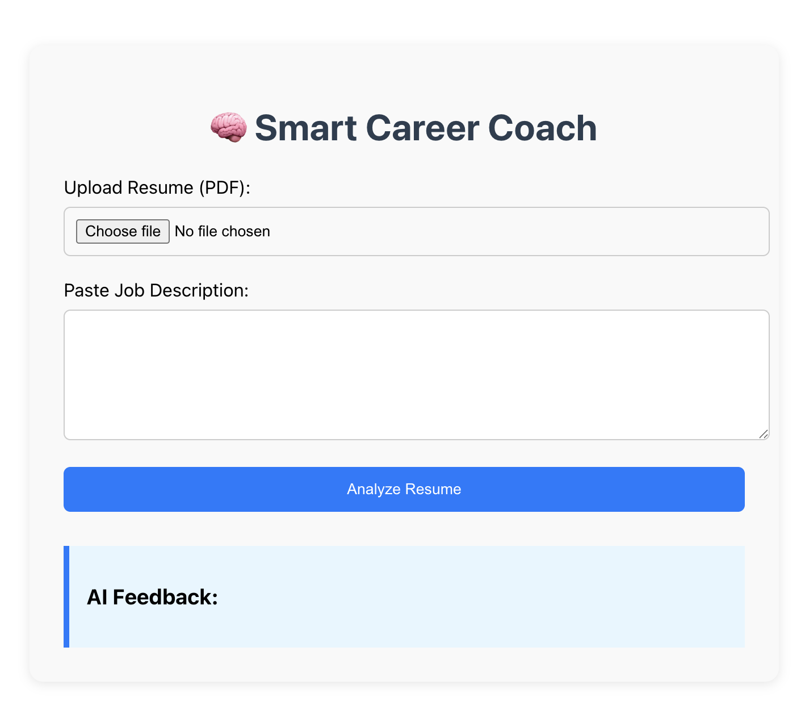

# 💼 Smart Career Coach

Smart Career Coach is an AI-powered full-stack web application that analyzes resumes against job descriptions and provides personalized, actionable feedback to help users improve their chances of landing their dream job.

---

## 🚀 Features

- Upload your **resume (PDF)**
- Paste a **job description**
- Get **AI-generated feedback** to tailor your resume for better job matches
- Built with **React**, **Express**, **OpenAI**, and **Node.js**

---

## 📁 Project Structure

smart-career-coach/
├── client/ # React frontend
├── server/ # Express backend with OpenAI & resume parser
├── README.md # Project documentation

---

## 🔧 Tech Stack

- **Frontend**: React.js, Axios
- **Backend**: Node.js, Express.js, Multer, pdf-parse, dotenv
- **AI Integration**: OpenAI GPT-4 API
- **File Handling**: Resume PDF parsing via `pdf-parse`
- **Deployment-ready**: API proxy setup, production build script

---

## 🛠️ Getting Started

### 1. Clone the Repository

git clone https://github.com/YOUR_USERNAME/smart-career-coach.git
cd smart-career-coach

### 2. Install Dependencies
   
Backend

cd server
npm install
Frontend

cd ../client
npm install

### 4. Setup .env in /server

OPENAI_API_KEY=your_openai_api_key

### 5. Start the App

Terminal 1 – Start Backend

cd server
node server.js

Terminal 2 – Start Frontend

cd client
npm start

App runs at: http://localhost:3000

